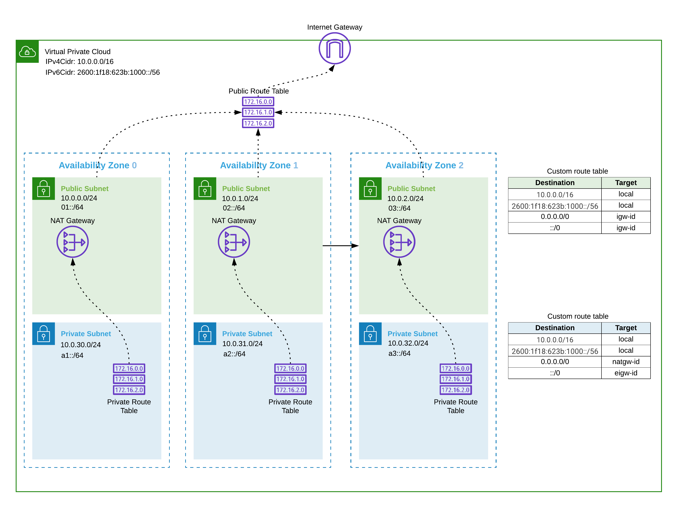

# Calico Enterprise Multi-cluster Management with Federation for Kubernetes on AWS

## Agenda

* Launch an Amazon VPC infrastructure stack using CloudFormation
* Launch Amazon EKS stacks into the Amazon VPC infrastructure using CloudFormation
* Deploy Calico Enterprise on each cluster
* Deploy Calico Enterprise Federation for Kubernetes
* Explore Calico Enterprise Federated Endpoint Identity
* Explore Calico Enterprise Federated Services

## Prerequisites

#### Install and configure calicoq cli tool

1. [Install](https://docs.tigera.io/getting-started/clis/calicoq/installing) the `calicoq` cli

```
export VERSION=3.2.0
```

```
docker pull quay.io/tigera/calicoq:v${VERSION}
docker create --name calicoq-copy quay.io/tigera/calicoq:v${VERSION}
docker cp calicoq-copy:/calicoq calicoq
docker rm calicoq-copy
chmod +x calicoq
mv calicoq /usr/local/bin/calicoq-${VERSION}
```

2. [Configure](https://docs.tigera.io/getting-started/clis/calicoq/configure/overview) `calicoq` cli

Example `/etc/calico/calicoctq.cfg`

```
apiVersion: projectcalico.org/v3
kind: CalicoAPIConfig
metadata:
spec:
  datastoreType: "kubernetes"
  kubeconfig: "/home/ubuntu/.kube/config"
```

## Notes

#### Launch an Amazon VPC infrastructure stack using CloudFormation

1. Choose an AWS region

```
export AWS_DEFAULT_REGION=us-east-1
```

2. Launch an Amazon VPC infrastructure stack using CloudFormation

```
aws cloudformation deploy \
  --no-fail-on-empty-changeset \
  --capabilities CAPABILITY_NAMED_IAM \
  --template-file cloudformation-infra.yaml \
  --tags StackType="infra" \
  --stack-name calico-demo \
  --parameter-overrides \
    VpcCidrBlock=10.0.0.0/16 \
    CreatePrivateNetworks=false
```

The base networking environment consists of a VPC with IPv4 and IPv6 addressing for subnets across three availability zones. The IPv4 network cidr is configurable and the IPv6 cidr is dynamically assigned by AWS.  Private subnets with a NAT gateway per availability zone can optionally be created.  Security groups and IAM roles used by EKS are also deployed as part of the base networking environment.



#### Launch Amazon EKS stacks into the Amazon VPC infrastructure using CloudFormation

1. Launch Amazon EKS stacks into the Amazon VPC infrastructure using CloudFormation

Ensure the [Amazon EKS-optimized Linux AMI](https://docs.aws.amazon.com/eks/latest/userguide/eks-optimized-ami.html) for your worker nodes exist in the AWS region you've chosen and also make sure the `KeyName` for the AWS Key Pair exists.

cluster-a

```
aws cloudformation deploy \
  --no-fail-on-empty-changeset \
  --capabilities CAPABILITY_NAMED_IAM \
  --template-file cloudformation-eks.yaml \
  --tags StackType="eks" \
  --stack-name calico-demo-eks-cluster-a \
  --parameter-overrides \
    EnvironmentName=calico-demo \
    KeyName=calico-demo \
    ImageId=ami-011c865bf7da41a9d \
    InstanceType=t3.2xlarge \
    WorkerNodeCount=2 \
    KubernetesVersion=1.16
```

cluster-b

```
aws cloudformation deploy \
  --no-fail-on-empty-changeset \
  --capabilities CAPABILITY_NAMED_IAM \
  --template-file cloudformation-eks.yaml \
  --tags StackType="eks" \
  --stack-name calico-demo-eks-cluster-b \
  --parameter-overrides \
    EnvironmentName=calico-demo \
    KeyName=calico-demo \
    ImageId=ami-011c865bf7da41a9d \
    InstanceType=t3.2xlarge \
    WorkerNodeCount=2 \
    KubernetesVersion=1.16
```

cluster-c

```
aws cloudformation deploy \
  --no-fail-on-empty-changeset \
  --capabilities CAPABILITY_NAMED_IAM \
  --template-file cloudformation-eks.yaml \
  --tags StackType="eks" \
  --stack-name calico-demo-eks-cluster-c \
  --parameter-overrides \
    EnvironmentName=calico-demo \
    KeyName=calico-demo \
    ImageId=ami-011c865bf7da41a9d \
    InstanceType=t3.2xlarge \
    WorkerNodeCount=2 \
    KubernetesVersion=1.16
```

2. Update your local kubeconfig to talk to the EKS clusters

```
aws eks update-kubeconfig --name calico-demo-eks-cluster-a --alias cluster-a
aws eks update-kubeconfig --name calico-demo-eks-cluster-b --alias cluster-b
aws eks update-kubeconfig --name calico-demo-eks-cluster-c --alias cluster-c
```

3. Update the `aws-auth-cm.yaml` with your account ID

Take a look at the `aws-auth-cm.yaml`.  This ConfigMap is used to allow your worker nodes to join the cluster. This ConfigMap is also used to add RBAC access to IAM users and roles.

```
ACCOUNTID=$(aws sts get-caller-identity --output text --query 'Account')
sed -i "" "s/ACCOUNTID/$ACCOUNTID/g" aws-auth-cm.yaml
```

You may have a different `sed` syntax so make sure the ConfigMap has been updated with your account ID.

4.  Apply the ConfigMap yaml to all the clusters and watch the cluster nodes come up

```
kubectl apply -f aws-auth-cm.yaml --context cluster-a
kubectl apply -f aws-auth-cm.yaml --context cluster-b
kubectl apply -f aws-auth-cm.yaml --context cluster-c
```

Make sure all the nodes show a `Ready` status before you proceed to installing Calico Enterprise

```
kubectl get nodes -o wide --context cluster-a
kubectl get nodes -o wide --context cluster-b
kubectl get nodes -o wide --context cluster-c
```

#### Deploy Calico Enterprise on each cluster

1. [Install Calico Enterprise on each Amazon EKS cluster](https://docs.tigera.io/getting-started/kubernetes/managed-public-cloud/eks)

We're going to add each EKS cluster to our pre-installed Multi-cluster Management cluster following the MCM [docs](https://docs.tigera.io/maintenance/mcm/configure).  

Follow the documentation and complete the rest of the installation steps for each cluster.

#### Deploy Calico Enterprise Federation for Kubernetes

1. [Create kubeconfig files](https://docs.tigera.io/networking/federation/kubeconfig)

Apply the Federation RBAC and service account for each cluster.

```
kubectl apply -f https://docs.tigera.io/getting-started/kubernetes/installation/federation-rem-rbac-kdd.yaml --context cluster-a
kubectl apply -f https://docs.tigera.io/getting-started/kubernetes/installation/federation-rem-rbac-kdd.yaml --context cluster-b
kubectl apply -f https://docs.tigera.io/getting-started/kubernetes/installation/federation-rem-rbac-kdd.yaml --context cluster-c

kubectl apply -f https://docs.tigera.io/getting-started/kubernetes/installation/federation-remote-sa.yaml --context cluster-a
kubectl apply -f https://docs.tigera.io/getting-started/kubernetes/installation/federation-remote-sa.yaml --context cluster-b
kubectl apply -f https://docs.tigera.io/getting-started/kubernetes/installation/federation-remote-sa.yaml --context cluster-c
```

Run the `create-remote-cluster-kubeconfigs.sh` to quicky create kubeconfigs for each cluster.

```
./create-remote-cluster-kubeconfigs.sh
```

2. [Configure access to remote clusters](https://docs.tigera.io/networking/federation/configure-rcc)

cluster-a

```
kubectl create secret generic remote-cluster-secret-cluster-b --context cluster-a -n calico-system --from-literal=datastoreType=kubernetes --from-file=kubeconfig=cluster-b-kubeconfig
kubectl create secret generic remote-cluster-secret-cluster-c --context cluster-a -n calico-system --from-literal=datastoreType=kubernetes --from-file=kubeconfig=cluster-c-kubeconfig
kubectl create -f remote-cluster-configuration-cluster-b.yaml --context cluster-a
kubectl create -f remote-cluster-configuration-cluster-c.yaml --context cluster-a
```

cluster-b

```
kubectl create secret generic remote-cluster-secret-cluster-a --context cluster-b -n calico-system --from-literal=datastoreType=kubernetes --from-file=kubeconfig=cluster-a-kubeconfig
kubectl create secret generic remote-cluster-secret-cluster-c --context cluster-b -n calico-system --from-literal=datastoreType=kubernetes --from-file=kubeconfig=cluster-c-kubeconfig
kubectl create -f remote-cluster-configuration-cluster-a.yaml --context cluster-b
kubectl create -f remote-cluster-configuration-cluster-c.yaml --context cluster-b
```

cluster-c

```
kubectl create secret generic remote-cluster-secret-cluster-a --context cluster-c -n calico-system --from-literal=datastoreType=kubernetes --from-file=kubeconfig=cluster-a-kubeconfig
kubectl create secret generic remote-cluster-secret-cluster-b --context cluster-c -n calico-system --from-literal=datastoreType=kubernetes --from-file=kubeconfig=cluster-b-kubeconfig
kubectl create -f remote-cluster-configuration-cluster-a.yaml --context cluster-c
kubectl create -f remote-cluster-configuration-cluster-b.yaml --context cluster-c
```

#### Explore Calico Enterprise Federated Endpoint Identity

1. Switch context to cluster-a and get all the endpoints using `calicoq`

```
kubectl config use-context cluster-a
calicoq eval "all()"
```

You should see output resembling the following

```
Endpoints matching selector all():
  Workload endpoint cluster-b/ip-10-0-0-219.ec2.internal/k8s/tigera-fluentd.fluentd-node-pzgbz/eth0
  Workload endpoint cluster-b/ip-10-0-0-219.ec2.internal/k8s/tigera-prometheus.alertmanager-calico-node-alertmanager-0/eth0
  Workload endpoint cluster-c/ip-10-0-2-129.ec2.internal/k8s/tigera-prometheus.prometheus-calico-node-prometheus-0/eth0
  Workload endpoint ip-10-0-0-252.ec2.internal/k8s/tigera-prometheus.alertmanager-calico-node-alertmanager-2/eth0
  Workload endpoint cluster-b/ip-10-0-0-219.ec2.internal/k8s/calico-system.calico-kube-controllers-8f7cd57c7-kszkn/eth0
  Workload endpoint cluster-b/ip-10-0-0-219.ec2.internal/k8s/tigera-compliance.compliance-benchmarker-cw4s7/eth0
  Workload endpoint cluster-b/ip-10-0-2-100.ec2.internal/k8s/tigera-fluentd.fluentd-node-hck58/eth0
  Workload endpoint cluster-c/ip-10-0-2-129.ec2.internal/k8s/tigera-fluentd.fluentd-node-fv6l6/eth0
  Workload endpoint cluster-c/ip-10-0-1-156.ec2.internal/k8s/tigera-intrusion-detection.intrusion-detection-controller-bb94cc49f-vbrkj/eth0
  Workload endpoint cluster-c/ip-10-0-2-129.ec2.internal/k8s/tigera-prometheus.calico-prometheus-operator-665cfb79b5-vgq4d/eth0
  Workload endpoint cluster-c/ip-10-0-2-129.ec2.internal/k8s/tigera-system.tigera-apiserver-7cf5f74d9f-ckm4g/eth0
  Workload endpoint ip-10-0-1-166.ec2.internal/k8s/kube-system.coredns-55c5fcd78f-rtk5x/eth0
  Workload endpoint ip-10-0-0-252.ec2.internal/k8s/tigera-fluentd.fluentd-node-c7pqd/eth0
  Workload endpoint ip-10-0-1-166.ec2.internal/k8s/tigera-prometheus.alertmanager-calico-node-alertmanager-1/eth0
  ...
```

Notice that we see the local cluster endpoints along with the remote cluster endpoints for cluster-b and cluster-c

2. Let's try another cluster. Switch context to cluster-c and get all the endpoints using `calicoq`

```
kubectl config use-context cluster-c
calicoq eval "all()"
```

You should see output resembling the following

```
Endpoints matching selector all():
  Workload endpoint ip-10-0-2-129.ec2.internal/k8s/tigera-compliance.compliance-benchmarker-fcjf8/eth0
  Workload endpoint ip-10-0-1-156.ec2.internal/k8s/tigera-prometheus.alertmanager-calico-node-alertmanager-0/eth0
  Workload endpoint cluster-a/ip-10-0-1-166.ec2.internal/k8s/kube-system.coredns-55c5fcd78f-pkrss/eth0
  Workload endpoint cluster-b/ip-10-0-2-100.ec2.internal/k8s/tigera-intrusion-detection.intrusion-detection-controller-68697669dc-mngsr/eth0
  Workload endpoint cluster-b/ip-10-0-0-219.ec2.internal/k8s/tigera-prometheus.calico-prometheus-operator-665cfb79b5-mg5gk/eth0
  Workload endpoint cluster-b/ip-10-0-0-219.ec2.internal/k8s/tigera-prometheus.prometheus-calico-node-prometheus-0/eth0
  Workload endpoint cluster-a/ip-10-0-0-252.ec2.internal/k8s/tigera-prometheus.prometheus-calico-node-prometheus-0/eth0
  Workload endpoint cluster-b/ip-10-0-2-100.ec2.internal/k8s/tigera-fluentd.fluentd-node-hck58/eth0
  Workload endpoint ip-10-0-1-156.ec2.internal/k8s/tigera-intrusion-detection.intrusion-detection-controller-bb94cc49f-vbrkj/eth0
  Workload endpoint ip-10-0-2-129.ec2.internal/k8s/tigera-prometheus.prometheus-calico-node-prometheus-0/eth0
  Workload endpoint ip-10-0-2-129.ec2.internal/k8s/tigera-system.tigera-apiserver-7cf5f74d9f-ckm4g/eth0
  Workload endpoint cluster-a/ip-10-0-1-166.ec2.internal/k8s/tigera-guardian.tigera-guardian-59b9bd5fff-54dbg/eth0
  Workload endpoint cluster-a/ip-10-0-1-166.ec2.internal/k8s/tigera-prometheus.alertmanager-calico-node-alertmanager-1/eth0
  Workload endpoint cluster-a/ip-10-0-0-252.ec2.internal/k8s/tigera-prometheus.alertmanager-calico-node-alertmanager-2/eth0
  ...
```

This time you should see local cluster endpoints from cluster-c and remote cluster endpoints from cluster-a and cluster-b

#### Explore Calico Enterprise Federated Services

1. Take a look at `my-app.yaml`.  

You should see a typical ClusterIP service that exposes a deployment of my-app with 2 replicas.

2. Deploy the `my-app` deployment and service to each cluster

```
kubectl apply -f my-app.yaml --context cluster-a
kubectl apply -f my-app.yaml --context cluster-b
kubectl apply -f my-app.yaml --context cluster-c
```

3. Examine each cluster's service endpoints

```
kubectl get endpoints my-app --context cluster-a
kubectl get endpoints my-app --context cluster-b
kubectl get endpoints my-app --context cluster-c
```

Notice that each cluster points to two endpoints.  Now let's deploy a federated service.

4. Take a look at `my-app-federated.yaml`.

Notice that there is no `spec.selector` field in the federated service. Instead there's an annotation with a value containing a standard Calico Enterprise selector (ie. the same as Calico Enterprise policy resources) in order to select services based on their labels.

```
  annotations:
    federation.tigera.io/serviceSelector: run == "my-app"
```

5. Deploy the `my-app-federated` service to each cluster

```
kubectl apply -f my-app-federated.yaml --context cluster-a
kubectl apply -f my-app-federated.yaml --context cluster-b
kubectl apply -f my-app-federated.yaml --context cluster-c
```

6. Examine each cluster's federated service endpoints

```
kubectl get endpoints my-app-federated --context cluster-a -o yaml
kubectl get endpoints my-app-federated --context cluster-b -o yaml
kubectl get endpoints my-app-federated --context cluster-c -o yaml
```

You should see each cluster's `my-app-federated` federated service has endpoints that target pods across all three EKS clusters

```
apiVersion: v1
kind: Endpoints
metadata:
  annotations:
    federation.tigera.io/serviceSelector: run == "my-app"
  creationTimestamp: "2020-08-10T21:17:12Z"
  name: my-app-federated
  namespace: default
  resourceVersion: "138104"
  selfLink: /api/v1/namespaces/default/endpoints/my-app-federated
  uid: f5460697-bbb3-4865-a665-c58db516f125
subsets:
- addresses:
  - ip: 10.0.0.151
    nodeName: ip-10-0-0-252.ec2.internal
    targetRef:
      kind: Pod
      name: my-app-7bc565bcb6-x9v6q
      namespace: default
      resourceVersion: "134504"
      uid: 58a69426-4bec-469c-b915-65c0bd55d4a3
  - ip: 10.0.0.251
    nodeName: ip-10-0-0-219.ec2.internal
    targetRef:
      kind: Pod
      name: cluster-b/my-app-7bc565bcb6-zdswk
      namespace: default
      resourceVersion: "134431"
      uid: 7777141d-2309-4097-99fe-4738331c8676
  - ip: 10.0.1.38
    nodeName: ip-10-0-1-156.ec2.internal
    targetRef:
      kind: Pod
      name: cluster-c/my-app-7bc565bcb6-hm77k
      namespace: default
      resourceVersion: "134717"
      uid: 0594f29d-c0fb-426b-a5a8-2b5119277a22
  ```

#### Teardown the Calico Enterprise Federated Endpoint Identity and Services demo stacks

1. Teardown the `calico-demo-eks-cluster-a` eks stack

```
aws cloudformation delete-stack --stack-name calico-demo-eks-cluster-a
aws cloudformation delete-stack --stack-name calico-demo-eks-cluster-b
aws cloudformation delete-stack --stack-name calico-demo-eks-cluster-c
aws cloudformation wait stack-delete-complete --stack-name calico-demo-eks-cluster-a
aws cloudformation wait stack-delete-complete --stack-name calico-demo-eks-cluster-b
aws cloudformation wait stack-delete-complete --stack-name calico-demo-eks-cluster-c
```

2. Teardown the `calico-demo` infra stack

```
aws cloudformation delete-stack --stack-name calico-demo
aws cloudformation wait stack-delete-complete --stack-name calico-demo
```

## References

* Everything You Need To Know About Kubernetes Networking on AWS: https://youtu.be/J1VbZR7j4sI
* Federation for Kubernetes: https://docs.tigera.io/networking/federation/overview
* Configure Calico Enterprise for multi-cluster management: https://docs.tigera.io/maintenance/mcm/configure
